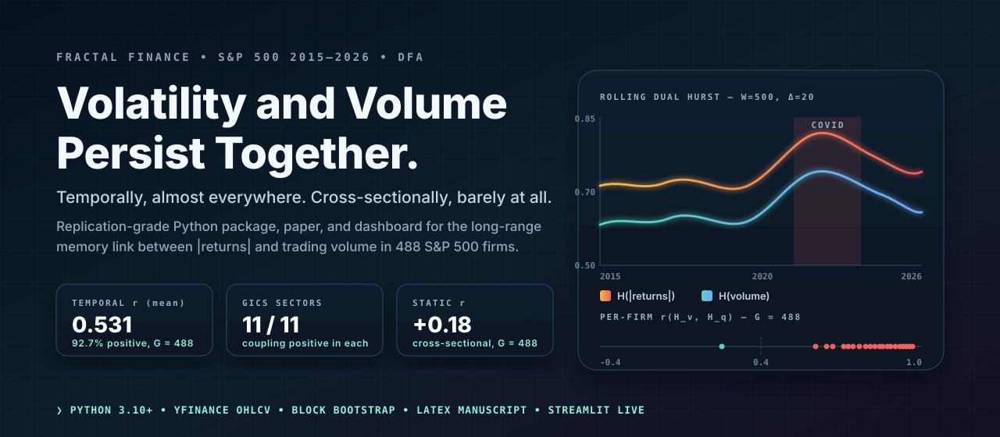

<p align="center">
  
</p>

<h1 align="center">Temporal Fractal Coupling Between Volatility and Volume</h1>

<p align="center">
  <strong>Replication package for a long-range-memory result that holds in time and fails in cross section.</strong>
</p>

<p align="center">
  <a href="https://doi.org/10.5281/zenodo.19611544"></a>
  <a href="https://fractal-pv.streamlit.app"></a>
  <a href="https://orcid.org/0009-0003-1036-9477"></a>
  
  
</p>

<p align="center">
  <a href="#claim">Claim</a> /
  <a href="#signal">Signal</a> /
  <a href="#method-pipeline">Method Pipeline</a> /
  <a href="#replicate-in-one-command">Replicate</a> /
  <a href="#repository-layout">Layout</a> /
  <a href="#citation">Citation</a>
</p>

## Claim

> The persistence structures of price volatility and trading volume co-evolve almost everywhere along time, but not at all across firms. A single Coupling Indicator Index `CII = (H_v + H_q)/2` then predicts future illiquidity but **not** future volatility once errors are clustered correctly.

Static, cross-sectional, and temporal regimes give different answers about the same pair of variables. The paper shows when each lens is the right one.

## Signal

| Finding | Statistic | Where in repo |
|---|---:|---|
| Temporal coupling: per-ticker `r(H_v, H_q)` is positive in 49/50 equities | mean `r = 0.665` | `research/paper/tables/table1_hurst_estimates.csv` |
| Static coupling is null in cross section | `r = -0.02` | `research/paper/tables/table3_sector_summary.csv` |
| CII predicts forward Amihud illiquidity | `t = 2.90`, `p = 0.004` (2-way clustered) | `src/fractal_pv/predict.py` |
| CII does not predict realized volatility under proper clustering | `t = 0.84` | `src/fractal_pv/inference_robust.py` |
| Crisis amplification (COVID) | coupling approximately doubles vs. pre-2020 baseline | `src/fractal_pv/regimes.py` |
| 11 robustness checks (estimator, window, sector, SE method) | findings stable across all checks | `research/robustness/RESULTS.md` |

## Method Pipeline

```mermaid
flowchart LR
    R["Yahoo Finance OHLCV<br/>50 tickers &#8226; 2015&#8211;2026"] --> P["Stationarity gate<br/>ADF / KPSS"]
    P --> H["DFA Hurst<br/>per series, full sample"]
    H --> W["Aligned rolling windows<br/>W = 500, &#916; = 20"]
    W --> Hv["H_v(t) on |returns|"]
    W --> Hq["H_q(t) on volume"]
    Hv --> C["CII(t) = (H_v + H_q)/2"]
    Hq --> C
    Hv --> Pcoup["Per-ticker temporal r"]
    Hq --> Pcoup
    C --> X["Forward panel regressions<br/>2-way clustered SE"]
    Pcoup --> B["Block bootstrap CIs<br/>Politis-Romano"]
    X --> O["Illiquidity / vol / volume<br/>multiple horizons"]
```



The estimator stack is deliberately conservative:

- **DFA** as the primary Hurst estimator; R/S and MFDFA wrappers for robustness.
- **Aligned rolling** windows so `H_v(t)` and `H_q(t)` are comparable point-wise.
- **Block bootstrap** (Politis & Romano 1994) for confidence intervals on per-ticker statistics.
- **Five SE methods** in the predictive panel: OLS, Newey-West, two-way clustered (firm + time), Driscoll-Kraay, and panel-bootstrap. The headline numbers above use two-way clustered.

## Replicate in one command

```bash
git clone https://github.com/mhdk1602/fractal-pv-coupling.git
cd fractal-pv-coupling
pip install -e .
python replicate.py
```

`replicate.py` is the master script. It runs:

1. Data fetch (Yahoo Finance, cached to `data/raw/`) &#8212; ~2 min
2. Full-sample DFA Hurst for returns, `|returns|`, and volume
3. Rolling dual-Hurst with `W = 500`, `&#916; = 20` &#8212; ~10 min
4. VIX regime classification and crisis-window split
5. Predictive panel with the five SE methods
6. Figure regeneration into `research/paper/figures/`
7. Headline summary printed to stdout

### Expected outputs

| Output | Location |
|---|---|
| Hurst estimates per ticker | `research/paper/tables/table1_hurst_estimates.csv` |
| Robustness summary | `research/paper/tables/table2_robustness_summary.csv` |
| Sector summary | `research/paper/tables/table3_sector_summary.csv` |
| 9 publication figures (PDF + PNG) | `research/paper/figures/fig1_*` to `fig9_*` |
| LaTeX manuscript | `research/paper/main.tex` (compile with `tectonic main.tex`) |
| Compiled PDF | `research/paper/main.pdf` |

## Repository layout

```
replicate.py                     Master replication script
src/fractal_pv/
  data.py                        Yahoo Finance download + parquet caching
  hurst.py                       DFA, R/S, MFDFA Hurst estimation
  stationarity.py                ADF / KPSS tests, series transforms
  bootstrap.py                   Block bootstrap CIs (Politis & Romano)
  rolling.py                     Rolling dual-Hurst, temporal correlation
  predict.py                     CII, forward metrics, panel regressions
  inference_robust.py            5 SE methods, sensitivity sweeps
  regimes.py                     VIX regime conditioning, crisis windows
  validate.py                    Theory-backed validation checks
  inference.py                   Finding extraction
research/
  paper/main.tex                 Manuscript source (LaTeX)
  paper/references.bib           46 BibTeX entries
  paper/figures/                 9 publication figures
  paper/tables/                  3 CSV data tables
  lineage/                       Original MSc report (Hari, 2013, KCL)
  robustness/RESULTS.md          11 robustness check results
app.py                           Streamlit dashboard entry
legacy/                          Original MATLAB code (2014), kept for provenance
```

## Data provenance

All data are daily OHLCV prices from Yahoo Finance via the `yfinance` package. No proprietary, restricted, or purchased data are used. The 50-ticker sample (Appendix A of the paper) spans all 11 GICS sectors and is continuously listed from January 2015 through April 2026. VIX data come from CBOE via Yahoo Finance. First-run downloads are cached to `data/raw/` as parquet.

## Companion artifacts

- [`fractal-pv-dashboard`](https://github.com/mhdk1602/fractal-pv-dashboard) &#8212; the deployed Streamlit explorer, with the same DFA stack and bootstrap CIs.
- [`hurst-aware-partitioning`](https://github.com/mhdk1602/hurst-aware-partitioning) &#8212; sibling pre-registration that reuses the Hurst estimator battery in a different problem domain (time-series database chunking).
- [`multiscale-governance-descriptors`](https://github.com/mhdk1602/multiscale-governance-descriptors) &#8212; sibling artifact that applies multi-scale descriptor thinking to lineage graphs instead of price series.

## Citation

```bibtex
@misc{hari2026fractal,
  author = {Hari, Dinesh},
  title  = {Static and Temporal Fractal Coupling Between Volatility and
            Trading Volume: Evidence from {S\&P}~500 Stocks, 2015--2026},
  year   = {2026},
  doi    = {10.5281/zenodo.19611544},
  url    = {https://doi.org/10.5281/zenodo.19611544}
}
```

## License

MIT &#8212; see [`LICENSE`](LICENSE).
