<p align="center">
  
</p>

<h1 align="center">Temporal Fractal Coupling Between Volatility and Volume</h1>

<p align="center">
  <strong>Replication package for a long-range-memory result that holds within firms over time and barely holds across them.</strong>
</p>

<p align="center">
  <a href="https://doi.org/10.5281/zenodo.19611544"></a>
  <a href="https://fractal-pv.streamlit.app"></a>
  <a href="https://orcid.org/0009-0003-1036-9477"></a>
  
  
</p>

<p align="center">
  <a href="#claim">Claim</a> /
  <a href="#signal">Signal</a> /
  <a href="#method-pipeline">Method Pipeline</a> /
  <a href="#replicate-in-one-command">Replicate</a> /
  <a href="#repository-layout">Layout</a> /
  <a href="#citation">Citation</a>
</p>

## Claim

> The persistence structures of price volatility and trading volume co-evolve almost everywhere along time. Across firms the same pair is only weakly related, a cross-sectional `r = 0.18` against a within-firm mean of `0.531`. The Coupling Intensity Index (CII), a trailing correlation between the two rolling Hurst exponents, carries **no** firm-specific forecast power for future illiquidity or volatility once standard errors are clustered correctly; the apparent predictive signal reduces to a cross-firm, time-period stress co-movement.

Static, cross-sectional, and temporal regimes give different answers about the same pair of variables. The paper shows when each lens is the right one.

## Signal

Headline figures are the `G = 488` S&P 500 panel. The 50-firm large-cap pilot that opened the project is kept as the last row, superseded.

| Finding | Statistic | Where in repo |
|---|---:|---|
| Within-firm temporal coupling, `r(H_v, H_q)` positive in 92.7% of firms and positive in all eleven GICS sectors | mean `r = 0.531`, median `0.615` | `research/rebuild_g488/RESULT.md` |
| Static cross-sectional coupling is small but statistically detectable, roughly threefold weaker than the within-firm coupling | `r = +0.18`, `p < 0.001` | `research/rebuild_g488/RESULT.md` |
| CII has **no** firm-conditional forecast power for forward illiquidity (an earlier positive `t = 2.90` was a share-volume Amihud artifact; the correct dollar-volume measure is null) | two-way clustered `t ≈ 0`, `p > 0.3`; 95% CI rules out a standardized effect `> 0.10` SD | `src/fractal_pv/inference_robust.py`, `research/sigma_cii/PRECISE_NULL.md` |
| CII does not predict realized volatility under proper clustering either | two-way clustered, not significant | `src/fractal_pv/inference_robust.py` |
| CII dispersion across firms is not a market-stress lead signal, confirmed at `G = 495` | no lead (Granger min `p = 0.57`), no coincidence (`|r| ≤ 0.14`) against VIX, SPY-RV, HYG-RV | `research/sigma_cii/CONFIRMATION_FULL.md` |
| Market stress widens the spread of coupling across firms rather than lifting its average | regime means `0.549 / 0.500 / 0.562` (low / medium / high VIX), high-VIX `σ = 0.44` against low-VIX `σ = 0.30`, Mann-Whitney high `>` low `p < 0.001` | `research/rebuild_g488/RESULT.md` |
| Eleven robustness checks on the 50-firm pilot (window, estimator, surrogate, non-overlap, sector, market factor) | ten stability checks pass, the eleventh is an exploratory Granger descriptive | `research/robustness/RESULTS.md` |
| Superseded 50-firm large-cap pilot, kept for provenance | mean `r = 0.665` with 49 of 50 positive; static `r = -0.02` | `research/paper/tables/table1_hurst_estimates.csv` |

## Method Pipeline

```mermaid
flowchart LR
    R["Yahoo Finance OHLCV<br/>488 S&amp;P 500 firms &#8226; 2015&#8211;2026"] --> P["Stationarity gate<br/>ADF / KPSS"]
    P --> H["DFA Hurst<br/>per series, full sample"]
    H --> W["Aligned rolling windows<br/>W = 500, &#916; = 20"]
    W --> Hv["H_v(t) on |returns|"]
    W --> Hq["H_q(t) on volume"]
    Hv --> C["CII(t) = trailing corr(H_v, H_q)"]
    Hq --> C
    Hv --> Pcoup["Per-ticker temporal r"]
    Hq --> Pcoup
    C --> X["Forward panel regressions<br/>2-way clustered SE"]
    Pcoup --> B["Block bootstrap CIs<br/>Politis-Romano"]
    X --> O["Illiquidity / vol / volume<br/>multiple horizons"]
```



The estimator stack is deliberately conservative.

- **DFA** as the primary Hurst estimator; R/S and MFDFA wrappers for robustness.
- **Aligned rolling** windows so `H_v(t)` and `H_q(t)` are comparable point-wise.
- **Block bootstrap** (Politis & Romano 1994) for confidence intervals on per-ticker statistics.
- **Six baseline SE methods** in the predictive panel, HC1, firm-clustered, time-clustered, two-way clustered (firm + time), Newey-West, and Driscoll-Kraay, plus two small-sample corrections, Bell-McCaffrey CR2 with Satterthwaite df and the wild cluster restricted bootstrap. The headline numbers above use two-way clustered.

### Known timing caveat

Rolling windows are stamped at their **midpoint**, not their right edge. At `W = 500` a window labelled `t` is estimated from raw data running 249 trading days past `t`, so CII at `t` overlaps the `[t+1, t+21]` window the forward outcome is measured over. The bias runs toward finding predictive power rather than away from it, which makes every reported null conservative and would inflate any positive result. `research/lookahead/` re-runs the primary H4 test with right-edge stamping, where the predictor is strictly backward-looking, and the firm-conditional null holds (two-way clustered `p = 0.171`, CR2 `p = 0.201`, wild cluster bootstrap `p = 0.148`). Full note in the `rolling_hurst` docstring and §Robustness of the manuscript.

## Replicate in one command

```bash
git clone https://github.com/mhdk1602/fractal-pv-coupling.git
cd fractal-pv-coupling
pip install -e .
python replicate.py
```

Read the scope before you read the output. `replicate.py` runs the **50-firm large-cap pilot** (`SP500_SAMPLE` in `src/fractal_pv/data.py`), which is the layer behind the figures and the three CSV tables. It does **not** reproduce the `G = 488` headline numbers. For those, run `python research/rebuild_g488/rebuild.py`, which rebuilds the full panel from live Yahoo Finance data and regenerates every core table into `research/rebuild_g488/RESULT.md`. Budget roughly 30 minutes with `data/raw/` already populated, longer on a cold fetch of ~500 tickers. Most of the time is the rolling DFA.

`replicate.py` is the master script for the pilot layer. It runs:

1. Data fetch (Yahoo Finance, cached to `data/raw/`) &#8212; ~2 min
2. Full-sample DFA Hurst for returns, `|returns|`, and volume
3. Rolling dual-Hurst with `W = 500`, `&#916; = 20` &#8212; ~10 min
4. VIX regime classification and crisis-window split
5. Predictive panel with the five SE methods
6. Figure regeneration into `research/paper/figures/`
7. Headline summary printed to stdout

### Expected outputs

| Output | Location |
|---|---|
| Hurst estimates per ticker | `research/paper/tables/table1_hurst_estimates.csv` |
| Robustness summary | `research/paper/tables/table2_robustness_summary.csv` |
| Sector summary | `research/paper/tables/table3_sector_summary.csv` |
| 10 publication figures (`fig1`&#8211;`fig9` as PDF + PNG, `fig10` as PDF) | `research/paper/figures/` |
| LaTeX manuscript | `research/paper/main.tex` (compile with `tectonic main.tex`) |
| Compiled PDF | `research/paper/main.pdf` |

## Repository layout

```
replicate.py                     Master replication script
src/fractal_pv/
  data.py                        Yahoo Finance download + parquet caching
  hurst.py                       DFA, R/S, MFDFA Hurst estimation
  stationarity.py                ADF / KPSS tests, series transforms
  bootstrap.py                   Block bootstrap CIs (Politis & Romano)
  rolling.py                     Rolling dual-Hurst, temporal correlation
  predict.py                     CII, forward metrics, panel regressions
  inference_robust.py            5 SE methods, sensitivity sweeps
  regimes.py                     VIX regime conditioning, crisis windows
  validate.py                    Theory-backed validation checks
  inference.py                   Finding extraction
research/
  paper/main.tex                 Manuscript source (LaTeX)
  paper/references.bib           46 BibTeX entries
  paper/figures/                 10 publication figures
  paper/tables/                  3 CSV data tables
  lineage/                       Original MSc report (Hari, 2013, KCL)
  robustness/RESULTS.md          11 robustness checks on the 50-firm pilot
  rebuild_g488/                  G=488 re-baseline, regenerates every core table
  sigma_cii/                     Cross-firm CII dispersion vs market stress
  lookahead/                     Right-edge stamping variant of the H4 null
tests/                           Pytest suite (`pytest` from the repo root)
app.py                           Streamlit dashboard entry
legacy/                          Original MATLAB code (2014), kept for provenance
```

## Data provenance

All data are daily OHLCV prices from Yahoo Finance via the `yfinance` package. No proprietary, restricted, or purchased data are used. The headline panel is the 488 April-2026 S&P 500 constituents that clear the inclusion criteria, spanning all 11 GICS sectors over January 2015 through April 2026; the 50-ticker large-cap pilot (Appendix A of the paper) is the earlier sample. Constituency is current as of April 2026, so the panel carries the survivorship profile usual for this construction. VIX data come from CBOE via Yahoo Finance. First-run downloads are cached to `data/raw/` as parquet.

## Companion artifacts

- [`fractal-pv-dashboard`](https://github.com/mhdk1602/fractal-pv-dashboard) &#8212; the deployed Streamlit explorer, with the same DFA stack and bootstrap CIs.
- [`hurst-aware-partitioning`](https://github.com/mhdk1602/hurst-aware-partitioning) &#8212; sibling pre-registration that reuses the Hurst estimator battery in a different problem domain (time-series database chunking).
- [`multiscale-governance-descriptors`](https://github.com/mhdk1602/multiscale-governance-descriptors) &#8212; sibling artifact that applies multi-scale descriptor thinking to lineage graphs instead of price series.

## Citation

```bibtex
@misc{hari2026fractal,
  author = {Hari, Dinesh},
  title  = {Static and Temporal Fractal Coupling Between Volatility and
            Trading Volume: Evidence from {S\&P}~500 Stocks, 2015--2026},
  year   = {2026},
  doi    = {10.5281/zenodo.19611544},
  url    = {https://doi.org/10.5281/zenodo.19611544}
}
```

## License

MIT &#8212; see [`LICENSE`](LICENSE).
